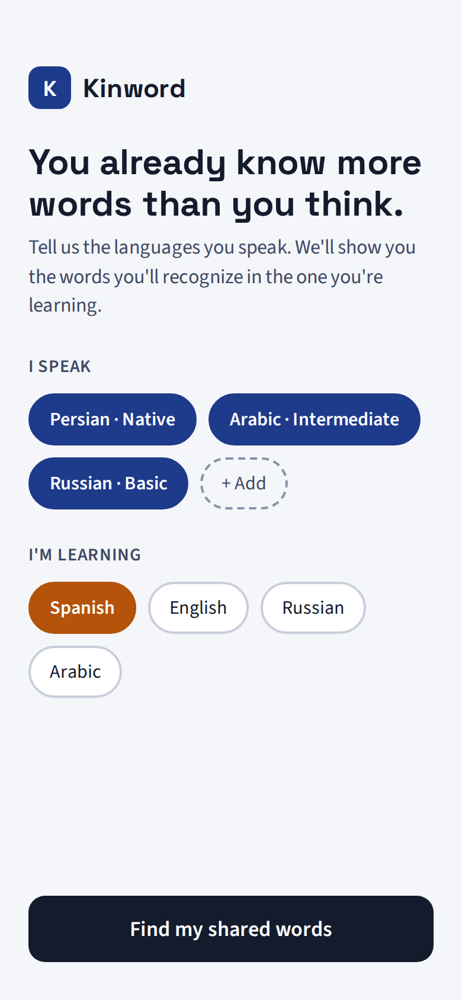
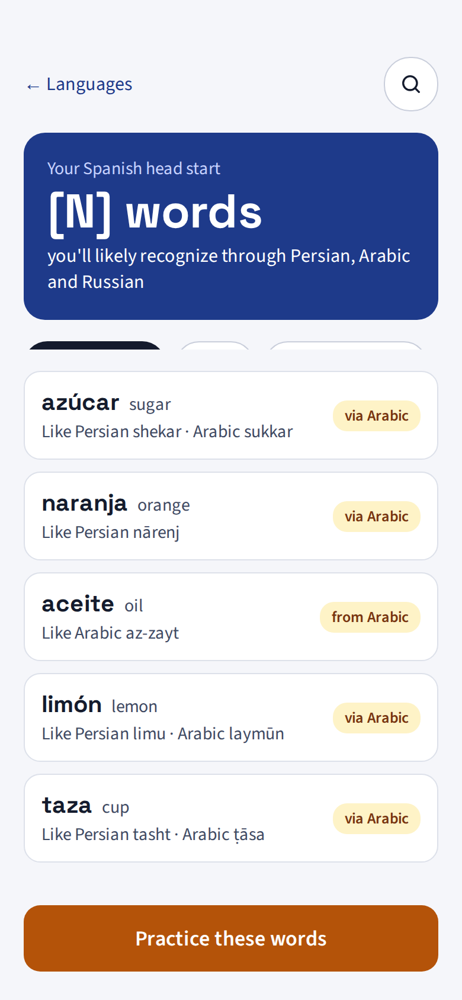
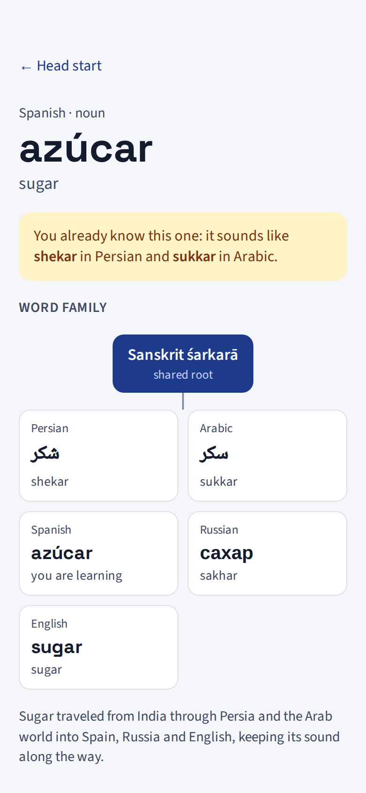
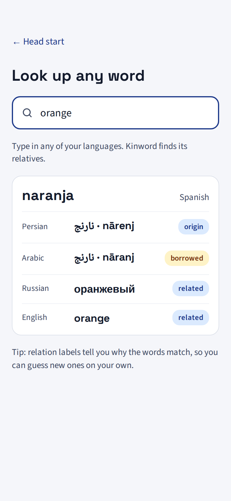
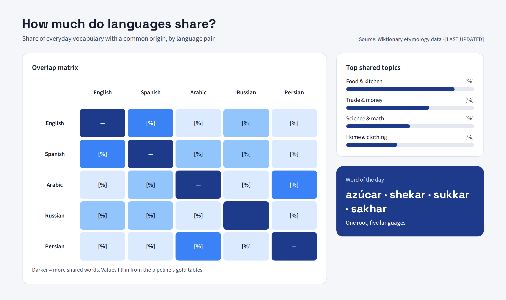

# Kinword

**Discover the words you already know.**

Kinword is a data platform that traces shared word origins across **Persian, Arabic, Spanish, Russian, and English**. You pick your native language and the language you want to learn, and Kinword shows the vocabulary you already recognize through shared roots, loanwords, and cognates. That way a new language starts out feeling familiar.

> **Status:** 🚧 Early development: architecture and data sourcing phase. See [Milestones](#milestones).

---

## Table of Contents

- [Why Kinword](#why-kinword)
- [How It Works](#how-it-works)
- [Who It's For](#who-its-for)
- [The End Product](#the-end-product)
- [UI Mockups](#ui-mockups)
- [Architecture](#architecture)
- [Tech Stack](#tech-stack)
- [Data Sources](#data-sources)
- [Data Model](#data-model)
- [Milestones](#milestones)
- [Project Structure](#project-structure)
- [Getting Started](#getting-started)
- [Challenges & Design Decisions](#challenges--design-decisions)
- [License & Attribution](#license--attribution)

---

## Why Kinword

Most language apps treat every learner as if they are starting from zero. That isn't true. A Persian speaker learning Spanish already knows hundreds of words without realizing it:

| Spanish | Arabic | Persian | Russian | English | Shared origin |
|---|---|---|---|---|---|
| azúcar | سكر (sukkar) | شکر (shekar) | сахар (sakhar) | sugar | Sanskrit *śarkarā* |
| aceituna | زيتون (zaytūn) | زیتون (zeytun) | — | — | Aramaic/Arabic *zaytūn* |
| bazar | بازار (bāzār) | بازار (bāzār) | базар (bazar) | bazaar | Persian *bāzār* |
| álgebra | جبر (jabr) | جبر (jabr) | алгебра (algebra) | algebra | Arabic *al-jabr* |

Centuries of trade, conquest, science, and migration spread words across these five languages. Arabic shaped Persian and Spanish. Persian reached Russian through Turkic languages. Greek, Latin, and French left international vocabulary everywhere. **Kinword makes that hidden overlap measurable and useful.**

The goal is to answer one question for a learner:

> *"Given the languages I already speak, which words in my target language do I already know, and how many?"*

## How It Works

Kinword has two parts. A **data pipeline** turns open linguistic data (Wiktionary etymologies and word-frequency lists) into a clean map of which words share an origin. A **learner app** then uses that map to show each person the words they already know in the language they're learning.

### 1. The data side: building the word map

The pipeline pulls word entries, etymologies, and translations from **Wiktionary** (via Wiktextract / kaikki.org) and word-frequency ranks from **wordfreq**, then processes them in stages:

1. **Ingest:** download the source data for each language and land it as-is in an S3 raw zone.
2. **Normalize:** clean the entries and transliterate Arabic, Persian, and Cyrillic words into a shared Latin form so they can be compared.
3. **Link:** connect words that share an origin (borrowings, inherited cognates, common ancestors), each with a relation type and a confidence score.
4. **Score:** rate each link for *recognizability* (how alike the words look and sound) and *usefulness* (how common the word is in the target language).
5. **Load:** model the results in a PostgreSQL warehouse with dbt, ready for the app to query.

Full details: [Architecture](#architecture) · [Data Sources](#data-sources) · [Data Model](#data-model)

### 2. The user side: what learners see

1. **Pick your languages:** choose the languages you speak and the one you're learning.
2. **Get your head start:** see a ranked list of target-language words you likely already recognize, and roughly how many there are.
3. **Explore word families:** open any word to see its relatives across languages and where it came from.
4. **Search:** look up any word in any of your languages and find its relatives.
5. **Compare languages:** a dashboard shows how much vocabulary each pair of languages shares, and in which topics.

See it in action: [UI Mockups](#ui-mockups) · [The End Product](#the-end-product)

## Who It's For

| User | What they get |
|---|---|
| **Language learners** (primary) | A head start: a list of target-language words they likely already understand, ranked by how common they are. |
| **Multilingual / heritage speakers** | A picture of how their languages connect, and which of their languages gives them the biggest head start. |
| **Language teachers** | Cognate lists for building lessons for students with specific native languages (e.g., Persian-speaking students learning Spanish). |
| **Curious readers & linguistics enthusiasts** | An explorable dashboard showing how much these languages borrowed from each other. |

## The End Product

**1. Learner Baseline (core feature)**
- Pick **native language(s)** → pick **target language**.
- Get a ranked list of target-language words you likely already know, grouped by origin (e.g., "from Arabic", "shared Latin roots").
- See a coverage estimate, e.g. *"You already recognize ~X of the 1,000 most common Spanish words."*
- Flag **false friends**: words that look the same but mean something different.

**2. Overlap Dashboard**
- Language-by-language overlap matrix across English, Spanish, Arabic, Russian, and Persian.
- Breakdown by origin (Arabic, Persian, Latin, Greek, French, Turkic, etc.).
- Word-level drill-down showing a word's journey across languages.

**3. Public API**
- REST endpoints for words, etymology links, and learner baselines, so other tools can build on the data.

## UI Mockups

Early design mockups of the learner flow (mobile) and the overlap dashboard (desktop). Placeholders like `[N]` and `[%]` will be filled from the pipeline's output.

| 1 · Pick your languages | 2 · Your head start | 3 · Word family | 4 · Search |
|:---:|:---:|:---:|:---:|
|  |  |  |  |

**5 · Overlap dashboard**



## Architecture

```
 ┌───────────────────┐     ┌─────────────────────┐     ┌──────────────────────┐
 │   Data Sources    │     │   Raw Zone (S3)     │     │  Curated Zone (S3)   │
 │ Wiktionary dumps  │───▶ │ JSONL / CSV as-is   │───▶ │ Parquet, normalized, │
 │ Frequency lists   │     │ partitioned by lang │     │ transliterated       │
 └───────────────────┘     └─────────────────────┘     └──────────┬───────────┘
          ▲                         ▲                             │
          │                         │                             ▼
   AWS Lambda (fetch)       Airflow (orchestration)       PySpark (linking &
                                                          scoring jobs)
                                                                  │
                                                                  ▼
 ┌───────────────────┐     ┌─────────────────────┐     ┌──────────────────────┐
 │  Web Dashboard    │◀─── │   FastAPI service   │◀─── │ PostgreSQL + dbt     │
 │  (Chart.js)       │     │   learner baseline  │     │ warehouse & marts    │
 └───────────────────┘     └─────────────────────┘     └──────────────────────┘
```

**Pipeline stages**

| Stage | What happens | Tooling |
|---|---|---|
| Extract | Download source dumps on a schedule, land them in S3 raw zone | AWS Lambda, S3 |
| Clean & normalize | Filter to target languages, strip diacritics where needed, transliterate to a shared form | PySpark |
| Link | Build etymology graph edges between words (borrowed / inherited / cognate / derived) | PySpark |
| Score | Similarity (edit distance on transliterations) × frequency rank → recognizability score | PySpark |
| Model | Star-schema warehouse and learner-facing marts | PostgreSQL, dbt |
| Serve | Learner baseline + overlap endpoints | FastAPI |
| Visualize | Overlap matrix, origin breakdowns, word drill-downs | Chart.js |
| Orchestrate | DAGs for ingestion, processing, and warehouse loads | Apache Airflow |

## Tech Stack

| Layer | Technology | Why |
|---|---|---|
| Language | **Python 3.11+** | Standard for data engineering; strong NLP/text libraries |
| Orchestration | **Apache Airflow** | Scheduled, observable, retryable pipelines |
| Processing | **PySpark** | Scales to full Wiktionary extracts (millions of entries) |
| Storage | **AWS S3** (raw + curated zones) | Cheap, durable data lake; Parquet for curated data |
| Serverless ingestion | **AWS Lambda** | Pay-per-use fetch jobs; keeps cloud costs to a few dollars/month |
| Warehouse | **PostgreSQL** | Relational model for words, links, and learner marts |
| Transformation | **dbt** | Tested, documented SQL models |
| API | **FastAPI** | Fast, typed, auto-documented REST API |
| Frontend | **Chart.js** (+ HTML/JS) | Lightweight, interactive charts |
| Containers | **Docker / Docker Compose** | One-command local environment |
| Infrastructure as Code | **Terraform** | Reproducible AWS setup |
| Local AWS | **LocalStack** | Develop against S3/Lambda without cloud costs |
| Testing / quality | **pytest**, dbt tests, Great Expectations *(planned)* | Data quality checks at every stage |
| CI/CD | **GitHub Actions** | Lint, test, and validate on every push |

**Cost target:** under ~$5/month in AWS by using free-tier–friendly services, LocalStack for development, and on-demand (not always-on) compute.

## Data Sources

| Source | Used for | License |
|---|---|---|
| [Wiktionary](https://www.wiktionary.org/) via [Wiktextract / kaikki.org](https://kaikki.org/) | Word entries, etymologies, translations, pronunciations | CC BY-SA 4.0 |
| [wordfreq](https://github.com/rspeer/wordfreq) | Word frequency ranks for all five languages | Data: CC BY-SA 4.0 |
| Manually curated seed list | Validating high-value links (e.g., Arabic → Spanish loanwords) | Project-owned |

*Sources may be added or changed as the project develops. All data attributions are kept in `docs/DATA_SOURCES.md`.*

## Data Model

A star schema centered on etymological links:

```
dim_language        (language_id, iso_code, name, script)
dim_word            (word_id, language_id, lemma, transliteration, part_of_speech, frequency_rank)
dim_origin          (origin_id, source_language, era, description)
fact_word_link      (link_id, word_id_a, word_id_b, origin_id, relation_type,
                     similarity_score, confidence, is_false_friend)

mart_learner_baseline   (native_lang, target_lang, word_id, recognizability_score, rank)
mart_language_overlap   (lang_a, lang_b, origin, shared_word_count, pct_top_1000)
```

`relation_type` ∈ `borrowed`, `inherited`, `cognate`, `derived`, `calque`

## Milestones

### Phase 0: Foundation 🚧
- [x] Create repository
- [x] Write project README and architecture plan
- [x] UI mockups for the learner flow and dashboard
- [ ] Set up repo structure, Docker Compose, and LocalStack
- [ ] Add CI (linting + tests) with GitHub Actions

### Phase 1: Data Ingestion (MVP: Spanish ↔ Arabic ↔ Persian)
- [ ] Download and explore Wiktextract data for the first three languages
- [ ] Lambda/Airflow job to land raw data in S3
- [ ] Profile data quality and document gaps

### Phase 2: Processing & Linking
- [ ] PySpark job: filter, clean, and normalize entries
- [ ] Transliteration for Arabic and Persian scripts
- [ ] Build etymology link table with relation types
- [ ] Similarity + frequency scoring
- [ ] Hand-validate a sample of 100 links for accuracy

### Phase 3: Warehouse
- [ ] PostgreSQL star schema
- [ ] dbt models, tests, and docs
- [ ] Learner baseline and overlap marts

### Phase 4: API & Dashboard (first usable version)
- [ ] FastAPI endpoints: `/words`, `/links`, `/baseline?native=fa&target=es`, `/overlap`
- [ ] Chart.js dashboard: overlap matrix and origin breakdown
- [ ] Learner baseline page

### Phase 5: Expansion
- [ ] Add Russian (Cyrillic transliteration) and English
- [ ] False-friend detection
- [ ] Deploy to AWS with Terraform
- [ ] Airflow DAGs on a schedule for data refreshes

### Phase 6: Beyond
- [ ] Add more languages (e.g., Turkish, French, Urdu) based on demand
- [ ] Phrase-level overlap, not just single words
- [ ] Learner feedback loop ("I knew this" / "I didn't") to improve scoring

## Project Structure

*(planned)*

```
kinword/
├── airflow/
│   └── dags/                 # Ingestion, processing, and warehouse DAGs
├── ingestion/
│   └── lambda/               # Source download functions
├── processing/
│   ├── jobs/                 # PySpark jobs (clean, transliterate, link, score)
│   └── transliteration/      # Script-to-Latin normalization per language
├── warehouse/
│   └── dbt/                  # dbt project: models, tests, docs
├── api/                      # FastAPI service
├── dashboard/                # Chart.js frontend
├── infra/
│   └── terraform/            # AWS infrastructure
├── data/
│   └── seed/                 # Curated validation lists
├── docs/                     # Architecture notes, data sources, decisions
├── tests/
├── docker-compose.yml
└── README.md
```

## Getting Started

> Setup instructions will be added as Phase 0 completes.

```bash
git clone https://github.com/mohsenyniki/kinword.git
cd kinword
# docker compose up   (coming soon)
```

## Challenges & Design Decisions

- **Multiple scripts.** Arabic, Persian, Cyrillic, and Latin scripts need a shared transliteration layer before words can be compared. Arabic and Persian also share a script but differ in letters and pronunciation.
- **Etymology is messy.** Wiktionary etymologies are written by volunteers and vary in format and completeness. Every link carries a **confidence score**, and a hand-validated sample keeps accuracy in check.
- **Shared origin ≠ recognizable.** Two words can share a root and still look nothing alike. Recognizability is scored separately from etymological relatedness.
- **False friends.** Words that look alike but differ in meaning are flagged instead of being counted as "known."
- **Start small, expand deliberately.** The MVP covers three languages the author speaks or is learning (Persian, Arabic, Spanish), which makes manual validation possible before scaling.

## License & Attribution

Code is released under the [MIT License](LICENSE).

Linguistic data derived from Wiktionary is licensed under [CC BY-SA 4.0](https://creativecommons.org/licenses/by-sa/4.0/). Derived datasets published by this project follow the same license.

---

Built by [Niki Mohseny](https://github.com/mohsenyniki), a Persian speaker who also speaks Arabic and some Russian and is now learning Spanish, and who kept noticing words she already knew.
